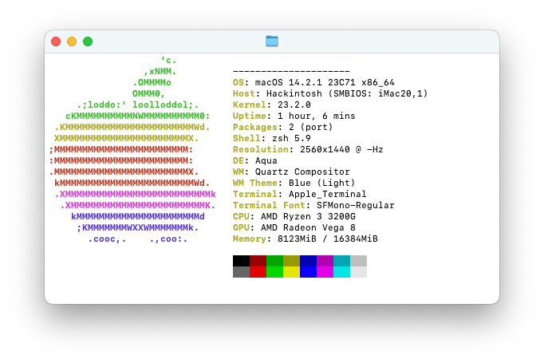

# ASRock-AB350m-Pro4-OpenCore
Install macOS Ventura on AB350m Pro4 and Ryzen 3200G on integrated GPU with Dual-Boot Win 10

### Information

**DO NOT** use this EFI. Please build your own as every machine is different in it's own way. **Only use this as a reference.**

  

  

---

**Table of Contents**

- [ASRock AB350m Pro4 (OpenCore)](#ASRock-AB350m-Pro4-OpenCore)
  - [Information](#information)
    - [Hardware](#hardware)
    - [Performance](#performance)
  - [Install macOS](#install-macos)
    - [1. BIOS Settings](#1-bios-settings)
    - [2. Sleep](#2-sleep)
    - [3. Tools](#3-tools)
    - [4. Audio](#4-audio)
    - [5. Ethernet](#5-ethernet)
	- [6. AirPort](#6-AirPort)
  - [Update macOS](#update-macos)
  - [DualBoot Windows](#dualboot-windows)
  - [Tools](#tools)
  - [Credits and Documentation](#credits-and-documentation)

---

#### Hardware

| Component    | Variant                                  
| ------------ | ---------------------------------------- |
| Mainboard    | ASRock AB350m Pro4     		          |
| Processor    | AMD Ryzen 3200G	                      |
| Graphics     | Radeon Vega 8 			                  |
| DDR4 RAM     | Mix of 3 different sticks   			  |
| NVMe SSD     | Kingston NV1 250GB                       |
| Ethernet     | Realtek RTL8111GR                        |
| WiFi / BT    | Apple AirPort Card (BCM943602CDP)        |

#### Performance

- For what? (haven't time for this)
- Bro, that's 3200G it can run nothing xd

---

### Install macOS

- Follow this guide [OpenCore-Install-Guide](https://dortania.github.io/OpenCore-Install-Guide/installer-guide/)

---

#### 1. BIOS Settings

    - USB Configuration
      - Legacy USB Support: Enabled
      - XHCI Hand-off: Enabled
    - Onboard Devices Configuration
        - Serial Port: Disabled
    - Boot
      - CSM (Compatibility Support Module)
      - Launch CSM: Disabled
    - Secure Boot
      - OS Type: Other OS

---

#### 2. Sleep

- Tested, working perfectly.

#### 3. Tools

- Install the following from Tools:
  - `ProperTree` to modify/update `config.plist`
  - `GenSMBIOS` to generate SMBIOS
  - `OpenCore Configurator` (OCC) to modify/update `config.plist`
  - `USBMap` to mapping USB
 
#### 4. Audio

- Onboard audio working via speakers jack, other not tested.

#### 5. Ethernet

- It works fine, there is nothing to add.

#### 6. AirPort

- It took me a whole day to get it to work. In short: you need to turn off SIP in recovery and patch root in OCLP and add few kexts to get working AirPort Card, but if you disable SIP some apps can no longer work (like Spotify). But(!) it fixes using AMFIPass.kext (included in EFI) and Spotify start working again.
 P.S: you DON'T need to turn on SIP in recovery.

---

### Update macOS

Check the official update-guide: [OpenCore-Post-Install/update](https://dortania.github.io/OpenCore-Post-Install/universal/update.html)

1. Backup
   - Full system backup with `Time Machine` or similar software
   - Copy current EFI to OpenCore USB-Drive for recovery purpose
2. Download
   - Latest version of OpenCore and replace files in EFI
   - Updates for all installed kexts and replace in EFI
3. Reboot
   - Boot with updated OpenCore version and kexts
   - If the system doesn't boot, use OpenCore USB-Drive to roll back
4. Update
   - Start macOS Update from `System Settings` -> `Software Update`
   - With OpenCore the update process should work automatically
   - If `Software Update` shows `Mac version is up to date`, download macOS Installer from AppStore and start the update manually

If the system doesn't boot, try to fix the problem or revert to the latest EFI or system-backup.

---

### DualBoot Windows

- Windows 10 on other SSD, so...

---

### Tools

| Name                   | Download                                                                                                    |
| ---------------------- | ----------------------------------------------------------------------------------------------------------- |
| ProperTree             | [corpnewt/ProperTree](https://github.com/corpnewt/ProperTree)                                               |
| MaciASL                | [corpnewt/GenSMBIOS](https://github.com/corpnewt/GenSMBIOS)                                                 |
| OpenCore Configurator  | [mackie100projects](https://mackie100projects.altervista.org/download-opencore-configurator/)               |
| USBMap                 | [corpnewt/USBMap](https://github.com/corpnewt/USBMap)                                                       |

---

### Credits and Documentation

This Hackintosh was build with help of the following repositories and guides:

| Help on Issue                    | Source                                                                                                                        |
| -------------------------------- | ----------------------------------------------------------------------------------------------------------------------------- |
| Beautifull OS (macOS)            | [Apple](https://www.apple.com/macos/ventura/)                                                                                 |
| Motivation                       | Me																											                   |
| OpenCore Installation Guide      | [OpenCore](https://dortania.github.io/)																					   |
